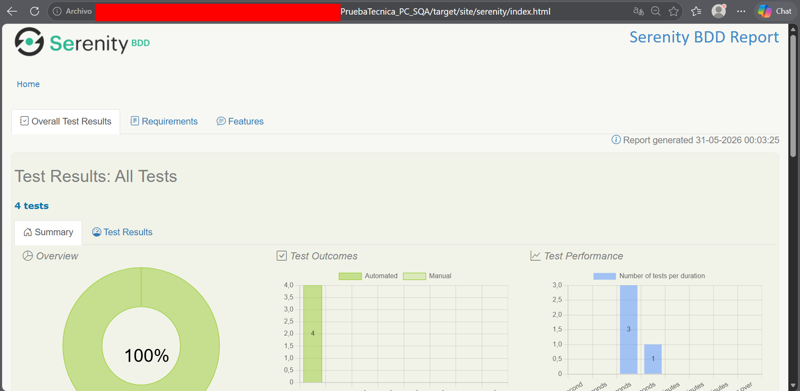
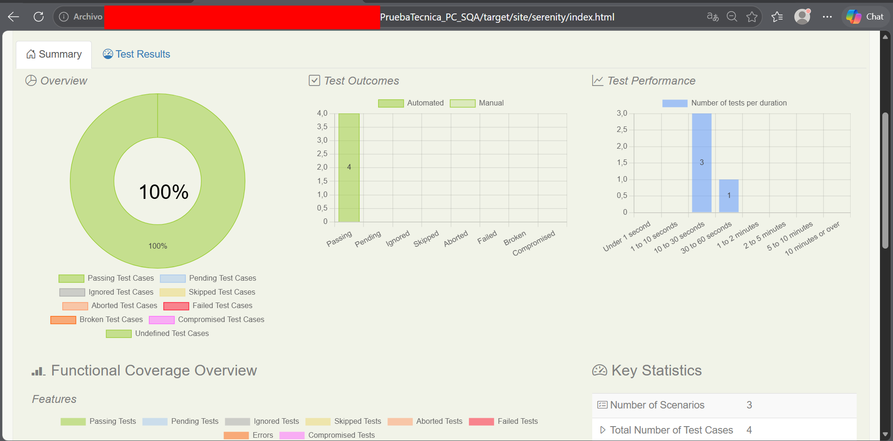
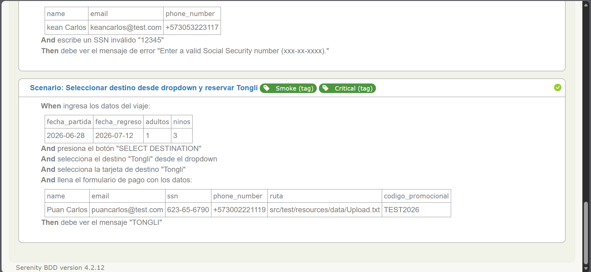
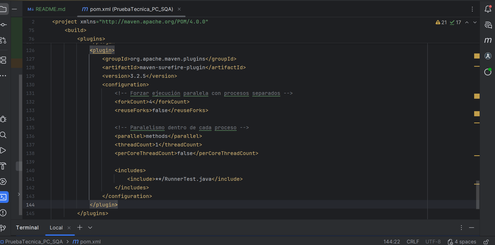

# Prueba Tecnica - Automatizacion QA

[](https://openjdk.org/)
[](https://maven.apache.org/)
[](http://serenity-bdd.info/)
[](https://serenity-bdd.github.io/theserenitybook/latest/screenplay.html)

## ?? Descripcion

Prueba tecnica para **PC / SQ** Automatizacion end-to-end de la pagina `https://demo.testim.io/` usando:

- Java 11
- Serenity BDD
- Screenplay Pattern
- Cucumber (Gherkin)
- JUnit 4
- Maven

## ?? Ejecutar pruebas

```bash
mvn clean verify

?? Reporte de Serenity
mvn serenity:aggregate

target/site/serenity/index.html





?? Reporte de Bugs
Ver BUGS_REPORT.md

?? Casos de prueba
Ver TEST_CASES.md

?? Configuracion de ejecucion paralela
La suite esto configurada para ejecucion paralela usando:

parallel=methods

threadCount=4


?? Autor
Jean Carlos Caro N.
QA Automation Engineer
jeancarls@gmail.com

?? Licencia
Este proyecto es solo para fines de evaluacion tecnica.

---


---

## ?? Resumen final

| Requisito | Estado |
|-----------|--------|
| Ejecucion paralela configurada | ? Si (en `pom.xml`) |
| Funciona con multiples navegadores | ?? Limitacion de la pagina demo |
| Documentacion | ? En `README.md` |

---

Limitaciones Tecnicas
La pagina https://demo.testim.io/ maneja estado por sesion (localStorage/sessionStorage), lo que impide multiples sesiones simultaneas. La configuracion de paralelismo este implementada y funcionaria en entornos que lo soporten.


---

## ? Estructura
PruebaTecnica_PC_SQA/
??? pom.xml
??? README.md
??? src/
? ??? test/
? ? ??? java/
? ? ? ??? runners/
? ? ? ? ??? RunnerTest.java
? ? ? ??? stepdefinitions/
? ? ? ? ??? BookDestinationSteps.java
? ? ? ??? tasks/
? ? ? ? ??? EnterTravelDetails.java
? ? ? ? ??? FilterByPrice.java
? ? ? ? ??? SelectDestinationCard.java
? ? ? ? ??? SelectDestinationFromDropdownTask.java
? ? ? ? ??? FillBasicInfoTask.java
? ? ? ? ??? UploadFileTask.java
? ? ? ? ??? FillSSNTask.java
? ? ? ? ??? FillInvalidSSNTask.java
? ? ? ? ??? ApplyPromoCodeTask.java
? ? ? ? ??? AcceptTermsTask.java
? ? ? ? ??? ValidatePriceCalculationTask.java
? ? ? ??? questions/
? ? ? ? ??? GetConfirmationMessage.java
? ? ? ? ??? GetSSNErrorMessage.java
? ? ? ??? user_interfaces/
? ? ? ? ??? TestimHomePage.java
? ? ? ? ??? DestinationsPage.java
? ? ? ? ??? CheckoutForm.java
? ? ? ??? interactions/
? ? ? ??? SelectDateFromCalendar.java
? ? ? ??? BlurField.java
? ? ? ??? UploadFile.java
? ? ??? resources/
? ? ??? features/
? ? ? ??? book_destination.feature
? ? ??? data/
? ? ? ??? Upload.txt
? ? ??? serenity.properties
??? BUGS_REPORT.md
??? TEST_CASES.md

