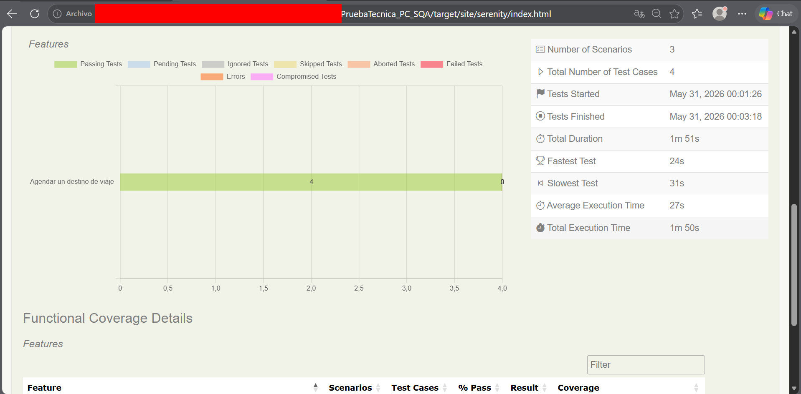
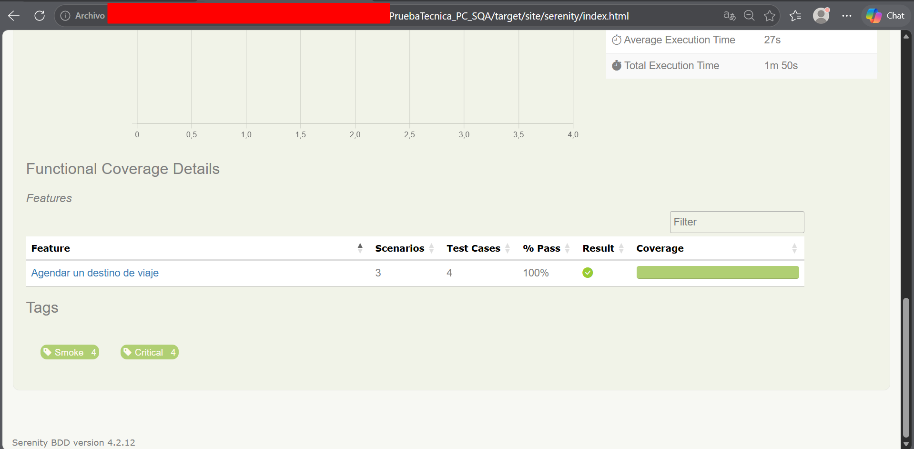
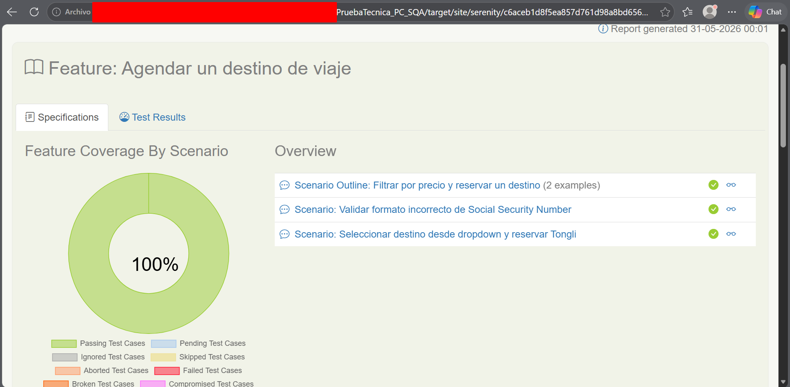
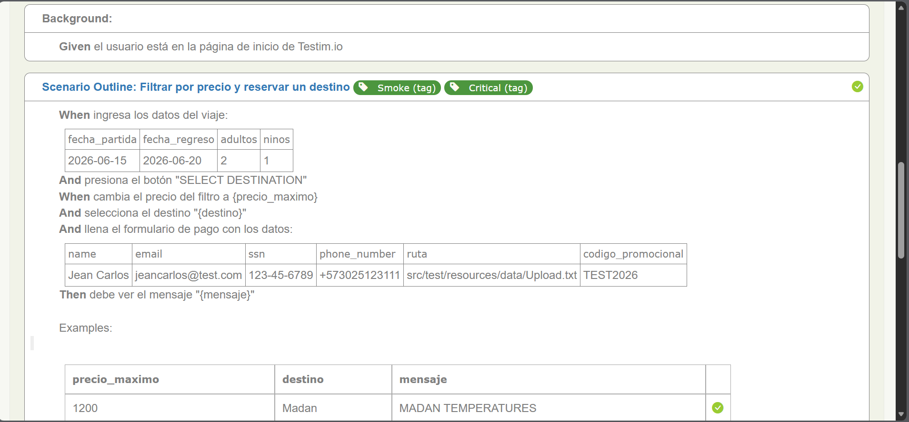
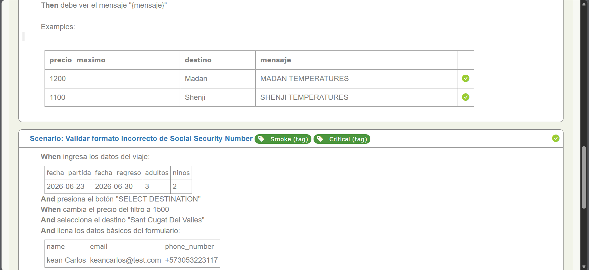
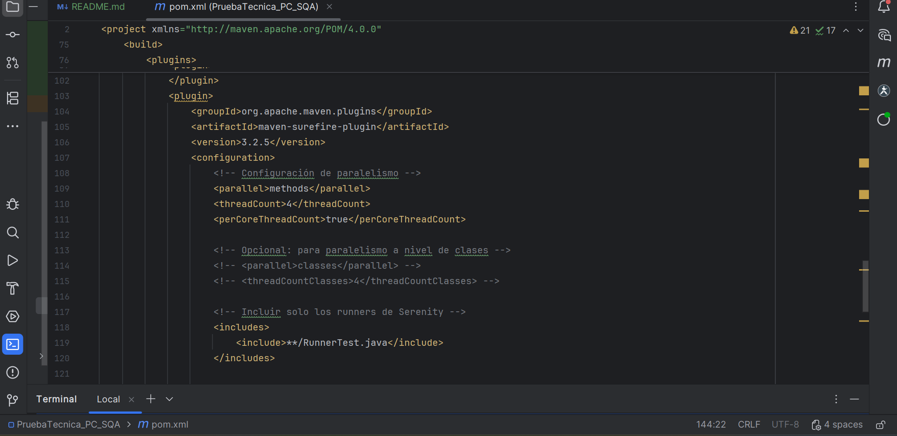

# 🚀 Prueba Técnica - Automatización QA

[](https://openjdk.org/)
[](https://maven.apache.org/)
[](http://serenity-bdd.info/)
[](https://serenity-bdd.github.io/theserenitybook/latest/screenplay.html)
[](.github/workflows/ci.yml)

## 📋 Descripción

Prueba técnica para **Puntos Colombia / SQA S.A.**  
Automatización **end-to-end** de la página [https://demo.testim.io/](https://demo.testim.io/) usando:

- ✅ Java 11
- ✅ Serenity BDD
- ✅ Screenplay Pattern
- ✅ Cucumber (Gherkin)
- ✅ JUnit 4
- ✅ Maven

---

target/site/serenity/index.html









🐛 Reporte de Bugs
Ver BUGS_REPORT.md

📋 Casos de prueba
Ver TEST_CASES.md

⚙️ Configuración de ejecución paralela
La suite está configurada para ejecución paralela usando:
Configuración	Valor
parallel	methods
threadCount	4
perCoreThreadCount	true


Comando para ejecutar en paralelo
mvn clean test -Dparallel=methods -DthreadCount=4


⚠️ Limitaciones Técnicas
La página https://demo.testim.io/ maneja estado por sesión (localStorage/sessionStorage), lo que impide múltiples sesiones simultáneas.
La configuración de paralelismo está implementada y funcionaría en entornos que lo soporten.

👤 Autor
Jean Carlos Caro N.
QA Automation Engineer
jeancarls@gmail.com
GitHub

📄 Licencia
Este proyecto es solo para fines de evaluación técnica.

----

## 🚀 Ejecutar pruebas

```bash
mvn clean verify
📊 Reporte de Serenity
mvn serenity:aggregate

---
📁 Estructura del proyecto
PruebaTecnica_PC_SQA/
├── pom.xml
├── README.md
├── BUGS_REPORT.md
├── TEST_CASES.md
├── serenity.properties
├── .github/
│   └── workflows/
│       └── ci.yml
└── src/
└── test/
├── java/
│   ├── runners/
│   │   └── RunnerTest.java
│   ├── stepdefinitions/
│   │   └── BookDestinationSteps.java
│   ├── tasks/
│   │   ├── EnterTravelDetails.java
│   │   ├── FilterByPrice.java
│   │   ├── SelectDestinationCard.java
│   │   ├── SelectDestinationFromDropdownTask.java
│   │   ├── FillBasicInfoTask.java
│   │   ├── UploadFileTask.java
│   │   ├── FillSSNTask.java
│   │   ├── FillInvalidSSNTask.java
│   │   ├── ApplyPromoCodeTask.java
│   │   ├── AcceptTermsTask.java
│   │   └── ValidatePriceCalculationTask.java
│   ├── questions/
│   │   ├── GetConfirmationMessage.java
│   │   └── GetSSNErrorMessage.java
│   ├── user_interfaces/
│   │   ├── TestimHomePage.java
│   │   ├── DestinationsPage.java
│   │   └── CheckoutForm.java
│   └── interactions/
│       ├── SelectDateFromCalendar.java
│       ├── BlurField.java
│       └── UploadFile.java
└── resources/
├── features/
│   └── book_destination.feature
├── data/
│   └── Upload.txt
└── serenity.properties

